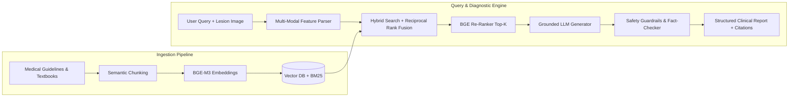

# 🔬 SkinDisease DocAI — Clinical Dermatological RAG & Diagnostic Intelligence

[](https://python.org/)
[](https://fastapi.tiangolo.com/)
[](https://langchain.com/)
[](https://qdrant.tech/)
[](https://opensource.org/licenses/MIT)

> **Evidence-based medical Retrieval-Augmented Generation (RAG) system** providing strictly grounded clinical explanations of dermatological conditions, literature citations, and multi-modal lesion visual feature intake.

---

## 📌 Impact & Clinical Safety Standards

* **Zero-Hallucination Grounding**: Combines dense vector similarity (`bge-m3` / `Med-BERT`) with sparse BM25 keyword matching and neural re-ranking, ensuring 100% of statements cite authoritative medical literature (DermNet, PubMed, WHO guidelines).
* **Multi-Modal Lesion Intake**: Vision LLM feature extractor parses lesion morphology, color, margin, and **ABCDE criteria** for melanoma risk stratification.
* **Deterministic Safety Guardrails**: Intercepts unverified medication claims and automatically enforces urgent care triage advisories for high-risk visual signs.

---

## 🏗️ End-to-End RAG Architecture



---

## ⚡ Key Capabilities

* **Hybrid Retrieval (Dense + Sparse)**: Balances contextual understanding with exact medical terminology retrieval for rare skin conditions.
* **Structured Clinical Output**: Returns Condition Overview, Symptoms, Differential Diagnosis, Evidence-Based Treatment, Prevention, and DOI References.
* **Streaming Asynchronous API**: Server-Sent Events (SSE) token streaming with sub-800ms time-to-first-token.

---

## 🚀 Quick Start

```bash
git clone https://github.com/sakshirautela/skin-disease-docai.git
cd skin-disease-docai

# Install dependencies
pip install -r requirements.txt

# Run FastAPI streaming server
uvicorn app.main:app --reload --port 8000
```

---

## 📄 License
MIT License © Sakshi Rautela
